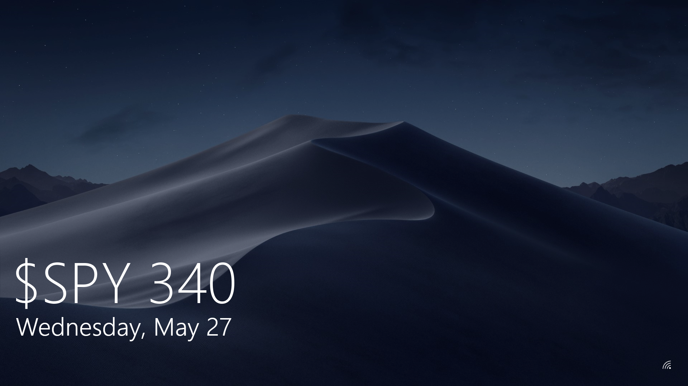

# win-options-time

*Now you can get options advice from your clock!*

It might be a little buggy but I've worked really hard to make sure that it
doesn't screw up anything permanently, your Robinhood account balance
notwithstanding.

### Taskbar

### Explorer

### Lockscreen

The lockscreen only works if you're logged in.

It's kinda rough when some of these plays are less stupid than the ones I make.

### Downloads

[win-options-time.exe](https://github.com/coalpha/win-options-time/releases/download/v1.1.0/win-options-time.exe)
