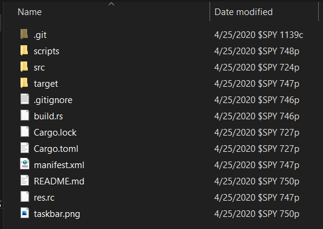

# win-options-time

*Now you can get options advice from your clock!*

Here's what it looks like on the taskbar:

It also shows up on anything that uses the builtin win32 APIs to format time.

It's kinda rough when some of these plays are less stupid than the ones I make.

### Downloads

[win-options-time.exe](https://github.com/coalpha/win-options-time/releases/download/v1.0.0/win-options-time.exe)

Alternatively, check out the [`v1.0.0` release page](https://github.com/coalpha/win-options-time/releases/tag/v1.0.0).

I haven't made an uninstaller yet because I'm lazy.

### Rant

I don't really have a good reason for making this other than "iT wAs A gOoD
lEaRnInG eXpErIeNcE".
Rust is pretty nice though. IDE support has gotten less bad with `rust-analyzer`
integration into VSCode. I must say, the syntax is kind of overwhelming but it's
way better than something with significant whitespace.
